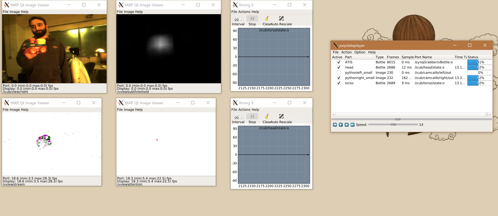

# Event-driven Spiking Attention
Create an event-driven spiking attention map to identify interesting regions in the scene

### Prerequisites
You should have learned about spiking neurons and how they are modelled in software, you should have a good knowledge of how to use the event-driven library to read and process events.

*Important - Assignment 1 is required for the smoke test to run. Please make sure that you have `make install`ed Assignment 1 so the _yarpmanager_ can find the binary file*

[Tutorial 1](https://github.com/vvv-school/tutorial_event-driven-framework)

[Tutorial 2](https://github.com/vvv-school/tutorial_event-handling)

[Assignment 1]()

## Assignment
You must complete the missing code in the provided module to identify interesting regions in the event stream. Incoming events will inject energy into an array of spiking neurons. The overlap between neighbouring nearons results in local regions with multiple activations reaching the neuron's threshold and and the resulting output spike indicates the location of high activity. Importantly, the activity must also occur in a contiguous period of time, before built-up energy is disapated due to the leaky dynamics.

To accomplish this task you have to modify the provided module **filling in the missing gaps** highlighted by the comment ``// FILL IN THE CODE``, to:

1. Update a single neuron according to the leaky-integrate-and-fire dynamics.
1. Update a square region of neurons given the centre position. The mean position of any neurons with an energy higher than the threshold must be calculated.
1. Create an ``event<LabelledAE>`` from the centre position of fired neurons.
1. Reset a region of neurons after a neuron has fired.
1. Read the event-stream and perform the above operations, writing ``event<LabelledAE>`` events on an output port.

The *saccadic suppression* module will be used remove events from the event-stream due to icub-motion. Burst of data due to moving the event-cameras themselves will not produce attention ponits. Attention will therefore only be produced by independently moving objects.

You can test your code on any of the provided event-driven [datasets]((https://github.com/vvv-school/tutorial_event-driven-framework) using the ``event-spiking-attention`` yarpmanager app. The final attention events will be visualised on a ``yarpview`` windows and should correspond to the position of the shaken object.

When you are happy with your attention module, you can test your code **Automatically**: [running the script **test.sh**](https://github.com/vvv-school/vvv-school.github.io/blob/master/instructions/how-to-run-smoke-tests.md) in the **smoke-test** directory. The smoke-test will give a maximum of 7 marks.

## Hints and Tips
- Only the event-stream from the right camera will be used. The ``vPreProcess`` module is used to split the event-stream into separate left and right streams.
- The provided _yarpmanager_ application visualises the subthreshold values of the neurons. If processing is slow on your laptop, closing this window (or disconnecting the port) reduce the processing load. The subthreshold visualisation might be useful for debugging purposes.
- A simple equation for a leaky integrate and fire neuron is `v = 1.0 + v * e^((t-t_p)/tau)`, where v is the subthreshold energy, t is the current time, t\_p is the previous time the neuron was updated, and tau is the decay factor.
- event timestamps (`ev::vEvent::stamp`) have a maximum value of 2^24. Each increment of the timestamp represents 80ns, therefore the timestamp field will overflow and wrap around every ~1.3 seconds. Therefore to calculate the time difference between two events that have wrapped you can: `if(v2->stamp < v1->stamp) v1->stamp -= ev::vtsHelper::max_stamp;` then `int dt = v2->stamp - v1->stamp` will be positive.
- If you want modify the default parameters please do so in the configuration of the RFmodule.

### [How to complete the assignment](https://github.com/vvv-school/vvv-school.github.io/blob/master/instructions/how-to-complete-assignments.md)
